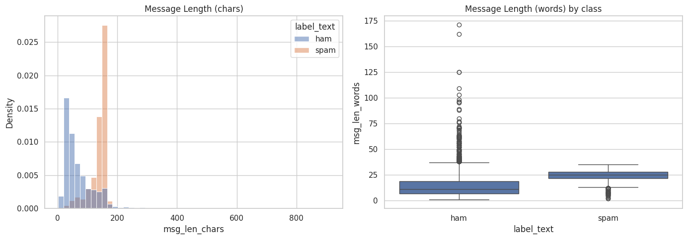
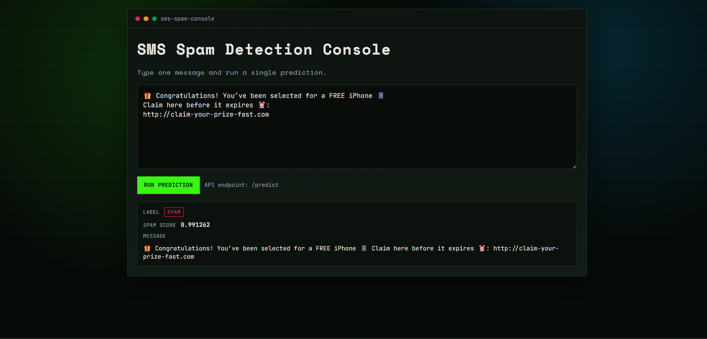

# Distributed SMS Spam Intelligence

An end-to-end Spark project for SMS spam detection, built as a notebook-first workflow in Google Colab.

## Project Scope
- Distributed data processing with PySpark.
- Data cleaning and EDA on the SMS Spam Collection dataset.
- TF-IDF feature engineering with multiple Spark classifiers.
- Validation-based hyperparameter tuning and model comparison.
- Model save/load and inference on new messages.

## Notebooks
1. `notebooks/01_data_quality_and_distributed_eda.ipynb`
   - Download dataset with `kagglehub`.
   - Clean labels/messages.
   - Class distribution and message length analysis.
   - Export artifacts to `/content/artifacts`.
2. `notebooks/02_modeling_pipeline.ipynb`
   - Load cleaned parquet artifacts.
   - Build Spark ML pipeline (Tokenizer -> StopWordsRemover -> HashingTF -> IDF -> classifier).
   - Split data into train, validation, and test.
   - Tune Logistic Regression, LinearSVC, and NaiveBayes using `ParamGridBuilder` + `TrainValidationSplit`.
   - Compare tuned models on held-out test split.
   - Evaluate and export metrics/comparison tables.
   - Save/reload model and run inference samples.
   - Zip and download the `/content/artifacts/models` folder for local API use.
3. `notebooks/03_inference_and_error_analysis.ipynb`
   - Load saved model and run full-dataset scoring.
   - Inspect uncertain predictions.
   - Export false positives and false negatives for manual review.

## EDA Snapshot

Message-length distribution generated in notebook 1:



## Local UI Preview

The FastAPI app includes a simple web UI (Jinja template) at the root route (`/`) for single-message testing.



## Dataset
Kaggle: SMS Spam Collection Dataset (`uciml/sms-spam-collection-dataset`).

Direct link: https://www.kaggle.com/datasets/uciml/sms-spam-collection-dataset

The notebook downloads the data directly using `kagglehub`, so no manual CSV placement is required in Colab.

Notes:
- You do not need a local `data/` folder when running in Colab.
- If you run locally, keep raw dataset files out of Git history.

## Reproducing Results (Colab)
1. Open notebook 1 and run all cells.
2. Open notebook 2 and run all cells.
3. Ensure both notebooks use the same runtime so notebook 2 can read artifacts from `/content/artifacts`.

## Latest Modeling Results
From `notebooks/02_modeling_pipeline.ipynb` using train/validation/test split (seed=42):

Selected final model: `LinearSVC_tuned`

Best model metrics on final test split:

| Metric | Value |
|---|---:|
| Accuracy | 0.9777 |
| Precision | 0.9352 |
| Recall | 0.9018 |
| F1-score | 0.9182 |

Confusion counts:
- TP: 101
- TN: 687
- FP: 7
- FN: 11

Model comparison (test split):

| Model | Accuracy | Precision | Recall | F1 |
|---|---:|---:|---:|---:|
| LinearSVC (tuned) | 0.9777 | 0.9352 | 0.9018 | 0.9182 |
| LogisticRegression (tuned) | 0.9715 | 0.9009 | 0.8929 | 0.8969 |
| NaiveBayes (tuned) | 0.9653 | 0.8333 | 0.9375 | 0.8824 |

## FastAPI Inference Service

This repo now includes a FastAPI app that loads a local saved Spark pipeline model.

Install dependencies:

```bash
py -3 -m venv .venv-fastapi
.\\.venv-fastapi\\Scripts\\Activate.ps1
pip install -r requirements-api.txt
```

Set the model path (optional, the local default is `fastapi_app/models/sms_spam_best_pipeline`):

```bash
# PowerShell
$env:MODEL_PATH="fastapi_app/models/sms_spam_best_pipeline"

# Bash
export MODEL_PATH=fastapi_app/models/sms_spam_best_pipeline

# Colab variant (if serving directly from Colab runtime)
export MODEL_PATH=/content/artifacts/models/sms_spam_best_pipeline
```

Run the API:

```bash
uvicorn fastapi_app.main:app --host 0.0.0.0 --port 8000
```

Open the UI at `http://127.0.0.1:8000/`.

Important:
- The API needs a local Spark PipelineModel directory.
- If you trained in Colab, export or download the model folder to your machine and set MODEL_PATH to that local folder.

Example request:

```bash
curl -X POST "http://127.0.0.1:8000/predict" \
   -H "Content-Type: application/json" \
   -d '{"message": "Win a free prize now"}'
```

HTTPie example:

```bash
http POST http://127.0.0.1:8000/predict message="Win a free prize now"
```
